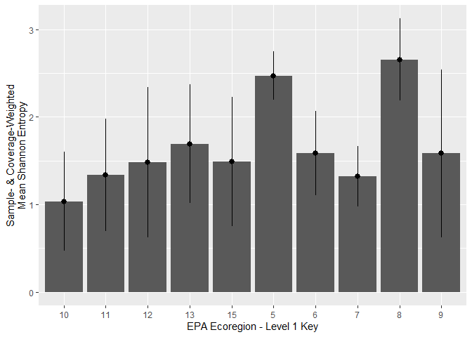

<!-- README.md is generated from README.Rmd. Please edit that file -->

# asgerbachelor

<!-- badges: start -->
<!-- badges: end -->

The goal of asgerbachelor is to …

## Installation

You can install the development version of asgerbachelor from
[GitHub](https://github.com/) with:

``` r
# install.packages("devtools")
devtools::install_github("asgersvenning/bachelor")
```

## Usage

This package was created to allow me to easily access the cleaned
datasets, USDA FIA/PLANTS & EPA ecoregions, and perform common
operations. The package is designed to be used with tidyverse as is
shown in the example:

``` r
library(asgerbachelor)
library(magrittr)
library(dplyr)
#> 
#> Vedhæfter pakke: 'dplyr'
#> De følgende objekter er maskerede fra 'package:stats':
#> 
#>     filter, lag
#> De følgende objekter er maskerede fra 'package:base':
#> 
#>     intersect, setdiff, setequal, union
library(ggplot2)

## Function for calculating variance of a weighted sample, robust to non-normalized weights.
## Might be added to the package, since it seems like a common enough operation, even though it is not directly linked to my project.
weighted.var <- function(x,w, na.rm=F) {
  if (na.rm) {
    x <- x[!is.na(x)]
    w <- w[!is.na(w)]
  }
  
  n <- length(x)
  if (n != length(w)) stop("Incorrect number of weights.")
  sum(w*(x-mean(x))^2)/((n-1)/n * sum(w))
}

## Calculate shannon entropy for all level 1 EPA ecoregions based on the FIA dataset
FIA_shannonEntropy <- FIA %>% 
  mutate(density = individuals/samples) %>% 
  group_by(INVYR, ID) %>% 
  mutate(normDensity = density/sum(density)) %>% 
  summarize(
    shannonEntropy = sum(-normDensity*log(normDensity)),
    samples = first(samples)
  )
#> `summarise()` has grouped output by 'INVYR'. You can override using the `.groups` argument.

EPA_level1 <- ecoregionsToGrid(grid = aggregationGrid, level = 1, simplify = 2500)
#> Warning: attribute variables are assumed to be spatially constant throughout all
#> geometries

EPA_level1 %>% 
  select(ID, L1_KEY, proportion) %>% 
  full_join(FIA_shannonEntropy, by = "ID") %>% 
  group_by(L1_KEY) %>% 
  filter(!is.na(L1_KEY)) %>% 
  summarize(
    meanShannonEntropy = weighted.mean(shannonEntropy, w = proportion * samples, na.rm = T),
    sdShannonEntropy = weighted.var(shannonEntropy, w = proportion * samples, na.rm = T)
  ) %>% 
  ggplot(aes(L1_KEY, y = meanShannonEntropy,
             ymin = meanShannonEntropy - sdShannonEntropy,
             ymax = meanShannonEntropy + sdShannonEntropy)) +
  geom_col() +
  geom_pointrange()
```


